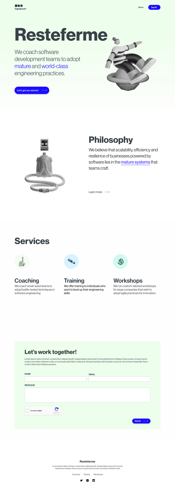

# Resteferme

#### Things I was able to achieve on this project

- Set up a local font with variables
- Implementing google recaptcha
- Implementing optimized images

# Resteferme

A landing page for a fictitious company that coaches and trains software development teams to
adopt mature and world-class engineering practices

## Table of contents

- [Overview](#overview)
  - [The challenge](#the-challenge)
  - [Screenshot](#screenshot)
  - [Links](#links)
- [My process](#my-process)
  - [Built with](#built-with)
  - [What I learned](#what-i-learned)
  - [Continued development](#continued-development)
  - [Useful resources](#useful-resources)
- [Author](#author)
- [Acknowledgments](#acknowledgments)

**Note: Delete this note and update the table of contents based on what sections you keep.**

## Overview

### The challenge

Users should be able to:

- View the optimal layout for the interface depending on desktop devices
- See hover and focus states for all interactive elements on the page

### Screenshot

### Links

- [Solution URL](https://github.com/josephakayesi/resteferme)
- [Live Site URL](https://resteferme.vercel.app/)

## My process

### Built with

- [NextJS](https://nextjs.org/)
- [Google reCAPTCHA](https://developers.google.com/recaptcha/docs/v3)
- Flexbox

### What I learned

- I learnt how to set up a local fonts with variables in NextJS

- I learnt how to implement Google reCAPTCHA.

- I learnt how to implement optimized images using NextJS

### Continued development

- I want to focus on creating more delightful UIs. Adding microinteractions to elements of the UI.

- I aim to enhance the responsiveness of the landing page, ensuring it accommodates various screen sizes for optimal user experience.

- I aim to run my application through a web performance tester and improve on the performance of the website

### Useful resources

- [NextJS Image Optimization](https://nextjs.org/docs/app/building-your-application/optimizing/images) - This helped me to understand:
  - Using Optimized images in NextJS
  - The benefits and importance of using optimized images
- [NextJS Docs](https://nextjs.org/docs) - This helped me to understand:

  - Setting up a NextJS project
  - The project structure of a NextJS Project

- [TailwindCSS](https://tailwindcss.com/) - This helped me to understand:

  - The use of a utility-first CSS framework

- [Ben Haig's Youtube Channel](https://www.youtube.com/watch?v=3h3w3LDEz74) - This helped me to understand:

  - How to setup Google reCAPTCHA in NextJS

## Author

- Website - [Joseph Akayesi](https://www.josephakayesi.com)
- Linkedin - [josephakayesi](https://www.linkedin.com/in/josephakayesi/)
- Twitter - [@josephakayesi](https://www.twitter.com/josepakayesi)

## Acknowledgments

Hats off to the [Victor Bruce](https://twitter.com/Victorbruce3) who had earlier provided feedback of my Figma design. One of my long time partners. I drew inspiration from a portfolio website I had built in a Webflow University Course. The title of the course is 21-day design portfolio course and you can find it [here](https://university.webflow.com/course-lesson/portfolio-course-introduction)
